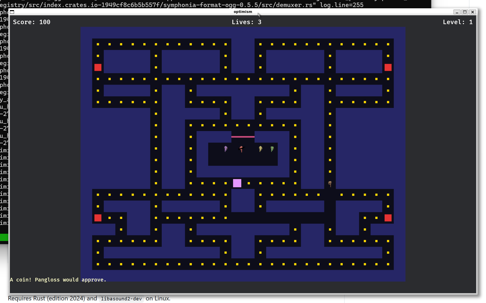

# Optimism

A Pac-Man-inspired game loosely based on Voltaire's *Candide, ou l'Optimisme*, built with [Bevy](https://bevyengine.org/) and instrumented with [Micromegas](https://madesroches.github.io/micromegas/) telemetry.

Play as **Candide**, navigating mazes, collecting money, and fighting off the Misfortunes — the Soldier, the Inquisitor, the Thief, and the Brute — while **Pangloss** narrates with increasingly unhinged optimism.

Weapons escalate from brass knuckles to chainsaw. Luxury items make you look ridiculous. The final level is a quiet garden with no enemies, no weapons, and no Pangloss.

*"The best of possible games. Or was it?"*



## Purpose

This project serves as a tutorial demonstrating how to integrate [Micromegas](https://madesroches.github.io/micromegas/) telemetry into a Rust game. Spans, metrics, and logging are woven into every system — not bolted on as an afterthought.

## Tech Stack

| Crate | Purpose |
|-------|---------|
| [Bevy 0.18](https://bevyengine.org/) | Game engine (2D rendering, ECS, UI) |
| [Micromegas 0.21](https://madesroches.github.io/micromegas/) | Telemetry: spans, metrics, logging |
| [Avian2D 0.5](https://github.com/Jondolf/avian) | 2D physics (wall colliders, sensor triggers) |
| [bevy_kira_audio 0.25](https://github.com/NiklasEi/bevy_kira_audio) | Audio playback |
| [bevy_asset_loader 0.25](https://github.com/NiklasEi/bevy_asset_loader) | Declarative asset loading |
| [pathfinding 4](https://github.com/evenfurther/pathfinding) | A* for enemy AI |

## Build and Run

Requires Rust (edition 2024) and `libasound2-dev` on Linux.

```bash
cargo build
cargo run
cargo test
```

## Art Pipeline

Sprites are pre-rendered from 3D [Quaternius](https://quaternius.com/) models via Blender. Requires Blender 4.x and Python 3.x.

```bash
# Assemble .blend files from Quaternius assets
blender -b -P tools/assemble_characters.py

# Render all characters to sprite sheets
python3 tools/render_all.py
```

## Audio Pipeline

Music (harpsichord via MIDI + FluidSynth) and SFX (numpy waveform synthesis) are procedurally generated. Requires `fluidsynth`, `fluid-soundfont-gm`, and `ffmpeg`.

```bash
pip install -r requirements.txt
python3 tools/generate_audio.py
```

## Integrating Micromegas in a Bevy Game

This section walks through the integration step by step, using this project as a reference.

### 1. Dependencies

Use the `micromegas` umbrella crate — it re-exports `micromegas::tracing`, `micromegas::telemetry_sink`, and `micromegas::telemetry` as submodules with well-managed internal dependencies. Add it along with the `tracing` ecosystem to `Cargo.toml`, and enable Bevy's `trace` feature so it emits `tracing` spans for schedules and systems.

```toml
[dependencies]
bevy = { version = "0.18", features = ["trace"] }
tracing = "0.1"
tracing-subscriber = { version = "0.3", features = ["registry"] }
micromegas = "0.21"
```

### 2. Bootstrap in main.rs

Micromegas must be initialized **before** Bevy. The setup has three phases that must happen in order:

```rust
use bevy::log::LogPlugin;
use bevy::prelude::*;
use bevy::tasks::{ComputeTaskPool, TaskPoolBuilder};
use micromegas::telemetry_sink::TelemetryGuardBuilder;
use micromegas::telemetry_sink::tracing_interop::TracingCaptureLayer;
use micromegas::tracing::dispatch::init_thread_stream;
use micromegas::tracing::levels::LevelFilter;
use tracing_subscriber::Registry;
use tracing_subscriber::layer::SubscriberExt;

fn main() {
    // Phase 1: Initialize the telemetry sink.
    // The guard must live for the entire program — drop it and telemetry stops.
    let _telemetry_guard = TelemetryGuardBuilder::default()
        .with_install_tracing_capture(false)   // we install our own subscriber below
        .build()
        .expect("failed to initialize telemetry");

    // Phase 2: Set a global tracing subscriber that captures Bevy's schedule
    // spans and log events into Micromegas.
    let log_layer = TracingCaptureLayer {
        max_level: LevelFilter::Info,
    };
    let subscriber = Registry::default()
        .with(MicromegasBridgeLayer)           // bridges Bevy schedule spans (see below)
        .with(log_layer);                      // captures log events
    tracing::subscriber::set_global_default(subscriber)
        .expect("failed to set tracing subscriber");

    // Phase 3: Pre-init the ComputeTaskPool with Micromegas thread callbacks.
    // This MUST happen before App::new() — Bevy's TaskPoolPlugin checks for an
    // existing pool and skips its own init if one is found.
    ComputeTaskPool::get_or_init(|| {
        TaskPoolBuilder::new()
            .on_thread_spawn(|| init_thread_stream())
            .on_thread_destroy(|| {
                micromegas::tracing::dispatch::flush_thread_buffer();
                micromegas::tracing::dispatch::unregister_thread_stream();
            })
            .build()
    });

    // Phase 4: Run Bevy — disable its LogPlugin since we handle logging ourselves.
    App::new()
        .add_plugins(DefaultPlugins.build().disable::<LogPlugin>())
        .add_plugins(MyGamePlugin)
        .run();
}
```

> **Note:** Spans require the environment variable `MICROMEGAS_ENABLE_CPU_TRACING=true`. Without it, `init_thread_stream()` is a no-op and spans are silently dropped. Logs and metrics always work regardless.

### 3. Bridge Bevy schedule spans

With Bevy's `trace` feature enabled, every schedule run (Update, FixedUpdate, etc.) emits a `tracing` span named `"schedule"`. A small `tracing_subscriber::Layer` forwards these into Micromegas named scopes. See [`src/tracing_bridge.rs`](src/tracing_bridge.rs) for the full implementation.

```rust
use micromegas::tracing::dispatch::{on_begin_named_scope, on_end_named_scope};
use micromegas::tracing::intern_string::intern_string;

pub struct MicromegasBridgeLayer;

impl<S> Layer<S> for MicromegasBridgeLayer
where
    S: Subscriber + for<'a> LookupSpan<'a>,
{
    fn on_new_span(&self, attrs: &Attributes<'_>, id: &Id, ctx: Context<'_, S>) {
        if attrs.metadata().name() != "schedule" { return; }
        let label = /* extract "name" field from attrs */;
        let interned = intern_string(&label);
        if let Some(span) = ctx.span(id) {
            span.extensions_mut().insert(ScheduleSpanData { name: interned });
        }
    }

    fn on_enter(&self, id: &Id, ctx: Context<'_, S>) {
        if let Some(span) = ctx.span(id) {
            if let Some(data) = span.extensions().get::<ScheduleSpanData>() {
                on_begin_named_scope(&BRIDGE_LOCATION, data.name);
            }
        }
    }

    fn on_exit(&self, id: &Id, ctx: Context<'_, S>) {
        // symmetric — call on_end_named_scope
    }
}
```

### 4. Instrument system functions with `#[span_fn]`

Annotate every Bevy system with `#[span_fn]` to get per-system spans in the trace timeline.

```rust
use micromegas::tracing::prelude::*;

#[span_fn]
fn move_player(mut query: Query<&mut Transform, With<Player>>, time: Res<Time>) {
    // ...
}
```

### 5. Emit metrics with `fmetric!` / `imetric!`

Use `fmetric!` for floating-point values and `imetric!` for integer counters.

```rust
use micromegas::tracing::prelude::*;

#[span_fn]
fn frame_telemetry(time: Res<Time>) {
    let dt_ms = time.delta_secs_f64() * 1000.0;
    fmetric!("frame_time_ms", "ms", dt_ms);
}

// Integer counter example
imetric!("kills", "count", total_kills as u64);
```

### 6. Logging

Micromegas provides its own `info!` macro. Since Bevy also exports `info!` via its prelude, disambiguate at call sites:

```rust
micromegas::tracing::prelude::info!("money_collected: score={}", score.0);
```

Or, in files that don't import Bevy's prelude, import it directly:

```rust
use micromegas::tracing::prelude::info;
info!("maze loaded: {} ({}x{})", path, width, height);
```

### 7. Frame and subsystem spans

For higher-level trace structure, you can wrap entire frames and logical subsystems in spans. This project uses:

- **Frame span** (sync) — wraps `Main::run_main` using `on_begin_scope` / `on_end_scope`
- **Subsystem spans** (async) — group related systems (Player, AI, Movement, Combat, etc.) using `on_begin_async_scope` / `on_end_async_scope` with `SystemSet` ordering

See [`src/plugins/telemetry.rs`](src/plugins/telemetry.rs) for the full implementation.

## Documentation

- [Game Design](docs/concept/OPTIMISM.md)
- [Architecture](docs/architecture/ARCHITECTURE.md)
- [Level Design Guidelines](docs/level_design_guidelines.md)

## License

[Apache 2.0](LICENSE)
